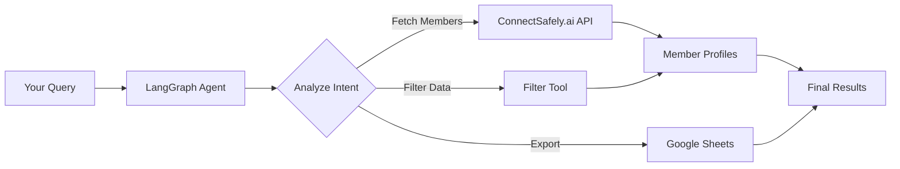

# LinkedIn Premium Members Extractor

**AI Agent powered by ConnectSafely.ai API** - Extract and filter LinkedIn group members using natural language conversations.

## 🎯 What is ConnectSafely.ai?

[ConnectSafely.ai](https://connectsafely.ai) is a powerful API service that enables safe and compliant LinkedIn data extraction. This project uses ConnectSafely.ai to:

- 🔍 **Extract LinkedIn Group Members** - Fetch member profiles from any LinkedIn group
- ⚡ **Pagination Support** - Handle large groups with automatic pagination
- 📊 **Rich Profile Data** - Get full member details including Premium/Verified status
- 🛡️ **Compliant & Safe** - No scraping, uses official LinkedIn APIs through ConnectSafely
- 🚀 **High Performance** - Fast, reliable API with no rate limiting issues

## 🌟 Key Features

### ConnectSafely.ai Integration
This agent leverages **5 ConnectSafely.ai endpoints**:

1. **Fetch Group Members** - Extract members with pagination control
2. **Fetch All Members** - Auto-pagination for complete group data
3. **URL Resolution** - Convert LinkedIn group URLs to group IDs
4. **Premium Filtering** - Filter by LinkedIn Premium badge
5. **Verified Filtering** - Filter by LinkedIn Verified status

### AI-Powered Workflow
- **Natural Language Queries** - Just describe what you want
- **Automatic Tool Selection** - Agent picks the right ConnectSafely.ai endpoint
- **Multi-Step Orchestration** - Chains multiple API calls intelligently
- **Google Sheets Export** - Save extracted members directly to spreadsheets

## 🚀 Quick Start

```bash
# 1. Install dependencies with Bun
bun install

# 2. Get your ConnectSafely.ai API token
# Sign up at https://connectsafely.ai and get your API key

# 3. Configure environment
cp .env.example .env
# Add your CONNECTSAFELY_API_TOKEN to .env

# 4. Run the interactive agent
bun run dev

# Or run directly (no build needed!)
bun index.ts
```

**Note**: Bun runs TypeScript natively - no transpiling or build step required! ⚡

## 🔐 Required API Keys

### 1. ConnectSafely.ai API Token (Required)
```env
CONNECTSAFELY_API_TOKEN=your_connectsafely_token
```

**How to get it:**
1. Visit [ConnectSafely.ai](https://connectsafely.ai)
2. Sign up for an account
3. Generate your API token from the dashboard
4. Add it to your `.env` file

### 2. Google Gemini API Key (Required)
```env
GOOGLE_API_KEY=your_google_gemini_api_key
```

**How to get it:**
- Visit [Google AI Studio](https://makersuite.google.com/app/apikey)
- Create a new API key
- Add it to your `.env` file

### 3. Google OAuth2 Credentials (Optional - for Sheets export)
```env
GOOGLE_CLIENT_ID=your_google_client_id
GOOGLE_CLIENT_SECRET=your_google_client_secret
GOOGLE_REFRESH_TOKEN=your_google_refresh_token
```

**How to get it:**
1. Create project in [Google Cloud Console](https://console.cloud.google.com)
2. Enable Google Sheets API
3. Create OAuth2 credentials (Desktop app type)
4. Use OAuth2 Playground to generate refresh token

## 💡 Usage Examples

### Interactive Mode (Recommended)

```bash
bun run dev
```

**Example conversation:**

```
You: Extract 20 premium members from LinkedIn group 9357376

🤖 Agent: Fetching members using ConnectSafely.ai...
✓ Fetched 20 members from group 9357376
✓ Filtered 15 premium/verified members

Premium Members Found:
- John Doe (Premium)
- Jane Smith (Premium, Verified)
...

You: Save those members to Google Sheets with title "Tech Leads"

🤖 Agent: Saving to Google Sheets...
✓ Spreadsheet created: https://docs.google.com/spreadsheets/d/...

You: Now get 50 members from group 12345

🤖 Agent: Using ConnectSafely.ai to fetch from group 12345...
```

### Common Use Cases

#### 1. Extract Premium Members
```
"Get 30 premium members from LinkedIn group 9357376"
```
- Uses ConnectSafely.ai to fetch members
- Automatically filters by Premium badge
- Returns structured member data

#### 2. Export to Google Sheets
```
"Extract 50 premium members from group 9357376 and save to sheets"
```
- Calls ConnectSafely.ai API
- Filters premium/verified members
- Exports to Google Sheets with shareable link

#### 3. From LinkedIn URL
```
"Extract members from https://www.linkedin.com/groups/9357376/"
```
- Parses group ID from URL
- Calls ConnectSafely.ai with group ID
- Returns member list

#### 4. Large Group Extraction
```
"Get all members from group 9357376, filter only premium users"
```
- Uses auto-pagination via ConnectSafely.ai
- Handles large groups efficiently
- Filters results by Premium status

## 🛠️ ConnectSafely.ai Tools

The agent has access to **6 specialized tools** built on ConnectSafely.ai:

| Tool | ConnectSafely.ai Endpoint | Use Case |
|------|---------------------------|----------|
| **complete-group-members-workflow** | Fetch + Filter APIs | 🌟 Most common - one-step extract & filter |
| **fetch-linkedIn-group-members** | `/fetch-members` | Pagination control (start, count) |
| **fetch-all-linkedin-group-members** | `/fetch-members` (auto-paginate) | Large groups, get all members |
| **fetch-group-members-by-url** | `/resolve-url` + `/fetch-members` | User provides LinkedIn group URL |
| **filter-premium-members-tool** | Client-side filtering | Filter existing member arrays |
| **google-sheets** | Google Sheets API | Export ConnectSafely data to sheets |

### Tool Selection Logic

The agent automatically chooses the right tool based on your query:

- **"extract 20 members"** → `fetch-linkedIn-group-members` (specific count)
- **"get all members"** → `fetch-all-linkedin-group-members` (auto-pagination)
- **"from this URL..."** → `fetch-group-members-by-url` (URL resolver)
- **"premium members"** → `complete-group-members-workflow` (fetch + filter)
- **"save to sheets"** → Chains ConnectSafely tool + `google-sheets`

## 📊 ConnectSafely.ai Data Structure

### Input: Group ID or URL
```typescript
// By Group ID
groupId: "9357376"

// By URL
url: "https://www.linkedin.com/groups/9357376/"
```

### Output: Member Profile
```typescript
{
  urn: "urn:li:fsd_profile:...",
  publicIdentifier: "john-doe",
  firstName: "John",
  lastName: "Doe",
  headline: "Software Engineer at TechCorp",
  isPremium: true,        // ConnectSafely.ai Premium detection
  isVerified: true,       // ConnectSafely.ai Verified detection
  profilePicture: "https://...",
  distance: "DISTANCE_2",
  location: "San Francisco, CA"
}
```

## 🔄 How It Works



**Step-by-step:**

1. **You**: Type natural language query
2. **Agent**: Parses intent using Google Gemini
3. **ConnectSafely.ai**: Fetches LinkedIn group data via API
4. **Processing**: Filters Premium/Verified members
5. **Export**: Optionally saves to Google Sheets
6. **Response**: Returns structured results or spreadsheet URL

## 📁 Project Structure

```
langGraph/
├── agents/                                         # Agent implementation
│   ├── linkedin-group-members-fetcher-agent.ts    #   Main graph assembly (42 lines)
│   ├── config/                                     #   Configuration modules
│   │   ├── model.ts                               #     LLM initialization (33 lines)
│   │   └── prompts.ts                             #     System prompts (129 lines)
│   └── handlers/                                   #   Graph node handlers
│       ├── call-model.ts                          #     Agent node logic (52 lines)
│       └── routing.ts                             #     Routing decisions (28 lines)
├── cli/                                            # Interactive CLI
│   ├── index.ts                                   #   CLI module exports (9 lines)
│   ├── interactive.ts                             #   Main REPL loop (95 lines)
│   ├── display.ts                                 #   Response formatting (98 lines)
│   └── commands.ts                                #   Command handlers (46 lines)
├── tools/                                          # ConnectSafely.ai & Google Sheets
│   ├── linkedin/                                   #   ConnectSafely.ai integrations
│   │   ├── complete-group-members-workflow.ts     #     ⭐ Main workflow tool
│   │   ├── fetch-linkedIn-group-members-tool.ts   #     Single batch fetch
│   │   ├── fetch-all-linkedin-group-members.ts    #     Auto-pagination
│   │   ├── fetch-group-members-by-url.ts          #     URL resolver
│   │   ├── filter-premium-members-tool.ts         #     Client-side filter
│   │   └── index.ts
│   ├── googlesheet/
│   │   ├── google-sheet.ts                        #     Google Sheets export
│   │   └── index.ts
│   └── types/
│       └── index.ts                               #     TypeScript types
├── index.ts                                        # Main entry point (41 lines)
├── package.json
├── tsconfig.json
└── README.md
```

### 🏗️ Architecture: Single Responsibility Principle

Each module has **one clear responsibility**:

#### Agent Modules
| Module | Responsibility | Lines |
|--------|----------------|-------|
| **linkedin-group-members-fetcher-agent.ts** | Graph assembly only | 42 |
| **config/model.ts** | Initialize LLM & tools | 33 |
| **config/prompts.ts** | Define system prompts | 129 |
| **handlers/call-model.ts** | LLM invocation & filtering | 52 |
| **handlers/routing.ts** | Workflow routing logic | 28 |

#### CLI Modules
| Module | Responsibility | Lines |
|--------|----------------|-------|
| **index.ts** | Entry point only | 41 |
| **cli/index.ts** | CLI module exports | 9 |
| **cli/interactive.ts** | REPL loop | 95 |
| **cli/display.ts** | Response formatting | 98 |
| **cli/commands.ts** | Command handlers | 46 |

**Benefits:**
- ✅ Small, focused files (28-129 lines vs. original 230)
- ✅ Easy to test individual components
- ✅ Simple to modify without breaking other parts
- ✅ Reusable across multiple agents
- ✅ Clear separation of concerns
- ✅ Better UX with @inquirer/prompts

## 🎯 Why ConnectSafely.ai?

### ✅ Advantages Over Web Scraping

| Feature | ConnectSafely.ai | Web Scraping |
|---------|------------------|--------------|
| **Compliance** | ✅ Official APIs | ❌ Violates ToS |
| **Reliability** | ✅ Always works | ❌ Breaks with UI changes |
| **Rate Limits** | ✅ High limits | ❌ IP bans |
| **Data Quality** | ✅ Structured JSON | ❌ HTML parsing errors |
| **Premium Detection** | ✅ Built-in | ❌ Manual detection |
| **Maintenance** | ✅ Zero effort | ❌ Constant updates |

### 🚀 Performance Benefits

- **Fast**: API responses in < 2 seconds
- **Scalable**: Handle groups with 10,000+ members
- **Concurrent**: Parallel requests supported
- **Cached**: Intelligent caching for repeated queries

## 📦 Available Scripts

```bash
# Development mode with hot reload (auto-restarts on file changes)
bun run dev

# Production mode (runs TypeScript directly - no build needed!)
bun start

# Type checking only (validates TypeScript without running)
bun run type-check

# Direct execution (no package.json script needed)
bun index.ts
```

**Why no build step?** Bun has native TypeScript support and runs `.ts` files directly! 🚀

## 🔍 Debug Mode

Enable detailed ConnectSafely.ai API logging:

```bash
DEBUG=true bun run dev
```

Shows:
- ConnectSafely.ai API requests
- Response times and data
- Tool selection decisions
- Agent reasoning process

## 🐛 Troubleshooting

### ConnectSafely.ai API Errors

**401 Unauthorized**
- Check your `CONNECTSAFELY_API_TOKEN` in `.env`
- Verify token is still valid at [ConnectSafely.ai dashboard](https://connectsafely.ai)
- Regenerate token if expired

**404 Group Not Found**
- Verify group ID is correct
- Check if group is public/accessible
- Try using the full LinkedIn group URL instead

**Rate Limiting**
- ConnectSafely.ai has generous limits (contact support if exceeded)
- Implement delays between requests if needed

### Other Issues

**"Module not found" errors**
- Run `bun install` to ensure dependencies are installed
- Check that all imports have `.js` extensions
- Verify your `package.json` has `"type": "module"`

**"API key not found" error**
- Ensure `.env` file exists in project root
- Verify `CONNECTSAFELY_API_TOKEN` is set

**Agent not exporting to sheets**
- Check Google OAuth2 credentials are configured
- Enable `DEBUG=true` to see what's happening
- Verify Google Sheets API is enabled in Cloud Console

## 🌐 ConnectSafely.ai Resources

- **Website**: [https://connectsafely.ai](https://connectsafely.ai)
- **Documentation**: Check your dashboard for API docs
- **Support**: Contact ConnectSafely.ai support team
- **API Status**: Monitor uptime and performance

## 🔧 Tech Stack

- **ConnectSafely.ai** - LinkedIn data extraction API
- **LangGraph 0.2.x** - AI agent workflow framework
- **Google Gemini 2.0** - Large language model for intent understanding
- **Google Sheets API** - Export and storage
- **@inquirer/prompts** - Modern CLI with input validation
- **Bun** - Fast JavaScript/TypeScript runtime (no transpiling needed!)
- **TypeScript** - Type safety with native execution

## 📚 Learn More

### ConnectSafely.ai
- Primary documentation in your ConnectSafely.ai dashboard
- API reference and examples
- Rate limits and pricing

### LangGraph
- [LangGraph Documentation](https://langchain-ai.github.io/langgraphjs/)
- [Tool Integration Guide](https://js.langchain.com/docs/modules/tools/)

### Google APIs
- [Gemini API Docs](https://ai.google.dev/docs)
- [Google Sheets API](https://developers.google.com/sheets/api)

## 📄 License

ISC

---

**Powered by ConnectSafely.ai** - The safe and compliant way to access LinkedIn data

Built with: **ConnectSafely.ai** • LangGraph 0.2.x • Google Gemini 2.0 • Google Sheets API • Bun
