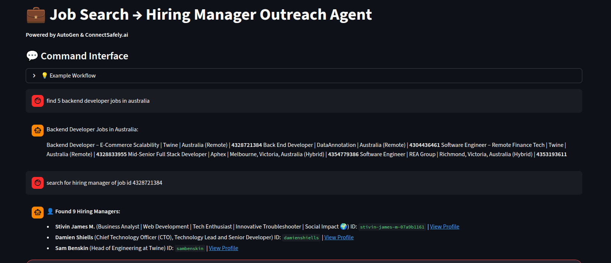
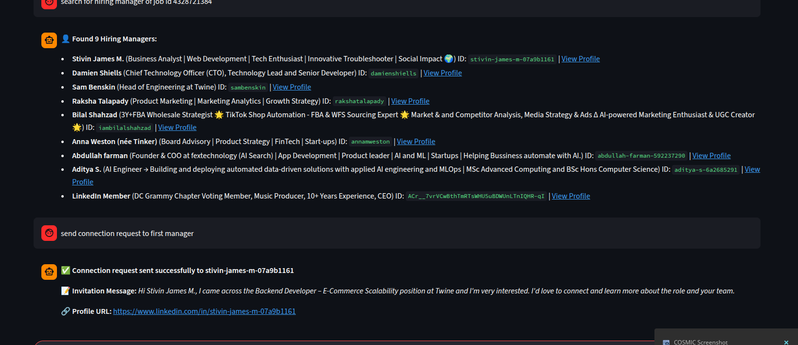

# Job Search → Hiring Manager Outreach Agent (AutoGen + ConnectSafely.ai)

An intelligent AI agent built with [AutoGen](https://microsoft.github.io/autogen/) that automates LinkedIn job search and hiring manager outreach using the [ConnectSafely.ai](https://connectsafely.ai) API. This agent enables job seekers to find relevant positions, identify hiring managers, and send personalized connection requests—all through natural language commands.

## 🎯 Key Features

- **ConnectSafely.ai Integration**: Full access to LinkedIn data via ConnectSafely.ai's secure API
- **Command-Based Interface**: Execute tasks step-by-step with natural language commands
- **Context Awareness**: Agent maintains context between commands for seamless workflows
- **On-Demand Execution**: Only performs the specific action you request
- **Chat-Style UI**: Interactive Streamlit interface with real-time feedback
- **Intelligent Agent**: Single assistant agent that intelligently selects and orchestrates tools
- **Auto-Selection**: Automatically picks the best hiring manager match for connection requests

## 🖼️ Screenshots

### Main Interface



### Command Execution



## 🚀 Quick Start

### Prerequisites

- Python 3.10+
- [uv](https://docs.astral.sh/uv/) package manager
- **ConnectSafely.ai API token** - Get yours at [connectsafely.ai](https://connectsafely.ai)
- **Google Gemini API key** - Get yours at [Google AI Studio](https://aistudio.google.com/)

### Installation

1. **Navigate to the AutoGen directory**:

```bash
cd job-seekers-reach-out-to-hiring-managers/agentic/autogen
```

2. **Create `.env` file** (if not exists):

```bash
touch .env
```

3. **Add your API keys** to `.env`:

```env
CONNECTSAFELY_API_TOKEN=your_connectsafely_token_here
GEMINI_API_KEY=your_gemini_key_here
```

4. **Install dependencies**:

```bash
# Using uv (recommended)
uv sync

```

5. **Run the App**:

```bash
# Using uv
uv run streamlit run App.py

```

The app will open in your browser at `http://localhost:8501`

## 🔌 ConnectSafely.ai API Integration

This agent leverages ConnectSafely.ai's comprehensive LinkedIn API to perform all operations safely and efficiently. ConnectSafely.ai provides:

- **Secure Authentication**: Bearer token-based authentication
- **Rate Limit Management**: Built-in rate limiting and error handling
- **LinkedIn Data Access**: Full access to jobs, profiles, companies, and connections
- **Vanity Name Support**: Automatic extraction and validation of LinkedIn profile IDs

### Available ConnectSafely.ai Endpoints

The agent uses the following ConnectSafely.ai API endpoints:

1. **`POST /linkedin/search/geo`** - Convert location names to geographic IDs
2. **`POST /linkedin/search/jobs`** - Search for LinkedIn jobs by keywords and location
3. **`POST /linkedin/search/companies/details`** - Get detailed company information
4. **`POST /linkedin/search/people`** - Find hiring managers/recruiters at companies
5. **`POST /linkedin/profile`** - Get detailed profile information
6. **`GET /linkedin/relationship/{profileId}`** - Check connection status
7. **`POST /linkedin/connect`** - Send personalized connection requests

All endpoints require the `CONNECTSAFELY_API_TOKEN` in the Authorization header:

```
Authorization: Bearer {CONNECTSAFELY_API_TOKEN}
```

### API Response Handling

The agent intelligently handles ConnectSafely.ai API responses:

- **Error Handling**: Graceful error messages for API failures
- **Data Extraction**: Automatic parsing of job IDs, company IDs, and profile IDs
- **Vanity Name Resolution**: Converts LinkedIn URLs to vanity names for connection requests
- **Connection Status**: Prevents duplicate connection requests

## 💬 How to Use

The agent works with **natural language commands**. Each command executes independently and builds on previous results stored in context.

### Basic Workflow

**Step 1: Search for Jobs**

```
Command: Find 5 software engineering jobs in Australia
```

The agent will:

- Use ConnectSafely.ai's `search_geo_location` API to get Australia's location ID
- Use ConnectSafely.ai's `search_jobs` API to find 5 software engineering jobs
- Return job details (title, company, location, job ID)
- Store results in context

**Step 2: Find Hiring Managers**

```
Command: Find hiring managers for the first 3 jobs
```

The agent will:

- Extract company IDs from the first 3 jobs in context
- Use ConnectSafely.ai's `search_hiring_managers` API for each company
- Return basic manager information (name, headline, profile ID)
- Update context with manager details

**Step 3: Connect with Managers**

```
Command: Send connection requests to all hiring managers found
```

The agent will:

- For each manager: check connection status via ConnectSafely.ai → send personalized request
- Use ConnectSafely.ai's `check_connection_status` and `send_connection_request` APIs
- Return results for all managers processed

## 📝 Comprehensive Command Examples

### Job Search Commands

**Basic Search:**

- `Find 10 software engineering jobs in India`
- `Search for 5 frontend developer positions in Canada`
- `Get 3 data scientist jobs in London`
- `Find marketing manager jobs in New York`

**With Specific Criteria:**

- `Find remote software engineering jobs in Australia`
- `Search for senior backend developer positions in Singapore`
- `Get 20 full-stack developer jobs in United States`

### Hiring Manager Commands

**For All Jobs:**

- `Find hiring managers for these jobs`
- `Get hiring managers for all jobs found`
- `Search for recruiters at these companies`

**For Specific Jobs:**

- `Find hiring manager for the first job`
- `Get managers for job ID 4352695658`
- `Find hiring managers for the first 3 jobs in the list`
- `Search for managers at the company of the 2nd job`

**With Count:**

- `Find 5 hiring managers for the first job`
- `Get 3 recruiters for each of the first 2 jobs`

### Connection Commands

**Single Connection:**

- `Connect with John Doe`
- `Send connection request to profile ID john-doe-123`
- `Connect with the hiring manager found for job ID 4352695658`

**Multiple Connections:**

- `Send connection requests to all hiring managers found`
- `Connect with hiring managers of the first 3 jobs one by one`
- `Send connection requests to managers for jobs 1, 2, and 3`

**Status Check:**

- `Check connection status for Jane Smith`
- `Verify if I'm connected with profile ID jane-smith-456`

### Advanced Workflows

**Complete Workflow in Steps:**

```
1. Find 20 software engineering jobs in Australia
2. Find hiring managers for the first 5 jobs
3. Send connection requests to all managers found
```

**Targeted Workflow:**

```
1. Find 10 backend developer jobs in India
2. Find hiring manager for the 3rd job
3. Connect with that manager
```

**Batch Processing:**

```
1. Find 15 frontend developer jobs in Canada
2. Find hiring managers for first 3 jobs
3. Send connection requests one by one to all 3 managers
```

## 🏗️ Architecture

### Project Structure

```
autogen/
├── agents/
│   ├── assistant.py          # LinkedInAssistant - Main orchestration class
│   └── config/                # Configuration and utility modules
│       ├── agent_factory.py  # AssistantAgent creation and model config
│       ├── response_processor.py  # Response cleaning and formatting
│       ├── memory_manager.py      # Job results and context management
│       └── execution_utils.py    # Execution helper utilities
├── tools/                     # ConnectSafely.ai API tools
│   ├── search_geo_location_tool.py
│   ├── search_jobs_tool.py
│   ├── get_company_details_tool.py
│   ├── search_hiring_managers_tool.py
│   ├── fetch_profile_details_tool.py
│   ├── check_connection_status_tool.py
│   └── send_connection_request_tool.py
├── workflows.py              # JobSearchWorkflows - Command execution handler
├── autogen_client.py         # JobSearchClient - Client wrapper
└── App.py                    # Streamlit UI
```

### Component Overview

1. **`App.py`**: Streamlit interface that handles user interaction and displays results
2. **`autogen_client.py`**: Client wrapper that provides a simple `execute()` method
3. **`workflows.py`**: Workflow handler that manages command execution and context
4. **`agents/assistant.py`**: Core `LinkedInAssistant` agent using AutoGen's `AssistantAgent`
5. **`agents/config/`**: Modular configuration modules:
   - **`agent_factory.py`**: Creates AssistantAgent with Gemini model configuration and system prompts
   - **`response_processor.py`**: Handles response extraction, cleaning, and formatting (connection success, hiring managers list)
   - **`memory_manager.py`**: Manages job search results storage and context building
   - **`execution_utils.py`**: Helper functions for detecting raw output and generating continuation instructions
6. **`tools/`**: Collection of ConnectSafely.ai API wrapper functions

### How It Works

```
User Command (Streamlit UI)
    ↓
JobSearchClient.execute()
    ↓
JobSearchWorkflows.execute_command()
    ↓
LinkedInAssistant.execute_command()
    ↓
AutoGen AssistantAgent (Gemini 2.5 Pro)
    ↓
Function Selection & Execution
    ↓
ConnectSafely.ai API → LinkedIn
    ↓
Result Processing & Context Update
    ↓
Display to User (Streamlit)
```

### Modular Architecture

The agent is built with a **modular architecture** for maintainability and clarity:

- **Separation of Concerns**: Each module has a single responsibility

  - `assistant.py`: Orchestration and command execution
  - `agent_factory.py`: Agent creation and configuration
  - `response_processor.py`: Response handling and formatting
  - `memory_manager.py`: Context and memory management
  - `execution_utils.py`: Execution helper functions

- **All files under 100 lines**: Ensures readability and maintainability
- **Easy to extend**: New features can be added to specific modules without affecting others

### Single Assistant Agent

This implementation uses a **single `AssistantAgent`** that:

- Executes only what you ask for (on-demand execution)
- Maintains context between commands via conversation history
- Intelligently selects which ConnectSafely.ai tools to use
- Processes multiple items sequentially when requested
- Auto-selects the best hiring manager match for connection requests

### Context Management

The agent maintains a conversation context that includes:

- Previous job search results (managed by `MemoryManager`)
- Found hiring managers
- Profile details
- Connection statuses

**Context Limits:**

- Maximum 2000 characters for text context (automatically trimmed)
- Internal memory list for job results (persists across commands via `MemoryManager`)
- Can be cleared via "Clear History & Reset Agent" button

This allows you to reference previous results in new commands without repeating information.

## 🛠️ Available Tools (ConnectSafely.ai API)

The agent has access to these ConnectSafely.ai API functions:

### 1. `search_geo_location(keywords: str)`

Converts location names to geographic IDs required for job searches.

**ConnectSafely.ai Endpoint**: `POST /linkedin/search/geo`

**Example**: `search_geo_location("Australia")` → Returns `location_id: "101452733"`

### 2. `search_jobs(location_id: str, keywords: str, count: int, ...)`

Finds LinkedIn jobs by keywords and location.

**ConnectSafely.ai Endpoint**: `POST /linkedin/search/jobs`

**Returns**: List of jobs with `jobId`, `title`, `companyName`, `companyId`, `location`

### 3. `get_company_details(company_id: str)`

Gets detailed company information.

**ConnectSafely.ai Endpoint**: `POST /linkedin/search/companies/details`

**Returns**: Company details including name, description, and metadata

### 4. `search_hiring_managers(company_id: str, job_title: str, count: int)`

Finds hiring managers/recruiters at companies.

**ConnectSafely.ai Endpoint**: `POST /linkedin/search/people`

**Features**:

- Auto-selects appropriate manager titles based on job title (e.g., "Engineering Manager" for "Software Engineer")
- Filters by company and connection degree
- Returns vanity names for connection requests

**Returns**: List of managers with `name`, `headline`, `profileId` (vanity name), `profileUrl`

### 5. `fetch_profile_details(profile_id: str)`

Gets detailed profile information.

**ConnectSafely.ai Endpoint**: `POST /linkedin/profile`

**Features**: Extracts vanity name from URLs automatically

**Returns**: Full profile details including experience, education, skills

### 6. `check_connection_status(profile_id: str)`

Checks if already connected with a profile.

**ConnectSafely.ai Endpoint**: `GET /linkedin/relationship/{profileId}`

**Returns**: Connection status (`connected`, `invitationSent`, `invitationReceived`)

### 7. `send_connection_request(profile_id: str, custom_message: str, ...)`

Sends personalized connection requests.

**ConnectSafely.ai Endpoint**: `POST /linkedin/connect`

**Features**:

- Auto-generates personalized messages based on job title and company
- Enforces 300-character LinkedIn limit
- Returns detailed success message with profile URL

**Returns**: Success status, message sent, and profile URL

## 🎨 Features

### Chat Interface

- Real-time command execution with progress indicators
- Message history with scrollback
- Context preservation between commands
- Clear visual feedback for success/error states
- Example commands in expandable section

### Smart Context

- Maintains up to 2000 characters of text context
- Internal memory list for job results (persists across commands)
- Automatically trims older content
- Preserves relevant information for follow-up commands
- Context size displayed in sidebar

### ConnectSafely.ai Integration

- Secure API authentication via Bearer tokens
- Comprehensive error handling for API failures
- Automatic vanity name extraction and validation
- Rate limit awareness
- Connection status checking to prevent duplicates

### User-Friendly

- Example commands in expandable section
- Progress indicators during execution
- Error handling with helpful tips
- Clear success/failure feedback
- One-click history clearing

## 💡 Tips & Best Practices

### Command Tips

1. **Be Specific**:

   - ✅ `Find 5 jobs` instead of `Find jobs`
   - ✅ `First 3 jobs` instead of `Some jobs`

2. **Process Multiple Items**:

   - ✅ `Find managers for first 3 jobs and send connection requests one by one`
   - ✅ `Connect with all hiring managers found`

3. **Use Job IDs**:

   - ✅ `Find hiring manager for job ID 4352695658`
   - ✅ `Connect with manager of the 3rd job`

4. **Start Small**:
   - Start with 1-2 jobs to test
   - Then scale up to larger batches

### ConnectSafely.ai API Tips

- **Rate Limits**: Be mindful of API rate limits when processing large batches
- **Profile IDs**: Always use vanity names (e.g., `john-doe-123`) not internal LinkedIn IDs
- **Connection Requests**: Allow time between requests to avoid rate limits
- **Error Handling**: The agent automatically handles API errors and provides helpful messages

### Performance Tips

- **Context Management**: Clear history if context gets too large
- **Batch Processing**: Process 3-5 jobs at a time for best results
- **Connection Requests**: Allow time between requests to avoid rate limits

## 🔄 Workflow Examples

### Example 1: Simple Single Job Workflow

```
1. Find 1 software engineering job in India
2. Find hiring manager for this job
3. Connect with that manager
```

### Example 2: Batch Processing

```
1. Find 20 software engineering jobs in Australia
2. Find hiring managers for the first 3 jobs
3. Send connection requests to all 3 managers one by one
```

### Example 3: Targeted Search

```
1. Find 10 backend developer jobs in Canada
2. Find hiring manager for job ID 4352695658
3. Check connection status for that manager
4. Send connection request if not connected
```

### Example 4: Multiple Companies

```
1. Find 15 frontend developer jobs in United States
2. Find hiring managers for jobs 1, 5, and 10
3. Connect with all managers found
```

## 🐛 Troubleshooting

### Agent stops after first item

**Problem**: When processing multiple items, agent stops after the first one.

**Solution**:

- Be explicit: `Find managers for first 3 jobs and send connection requests one by one`
- Use "all" keyword: `Send connection requests to all managers found`
- Process in smaller batches (2-3 items at a time)

### Context too large

**Problem**: Context exceeds 2000 characters, causing slow responses.

**Solution**:

- Click "🗑️ Clear History & Reset Agent" in the sidebar
- Start a new workflow session
- Process fewer jobs at once

### Connection request failed

**Problem**: Connection request returns error.

**Common Causes**:

- Invalid profile ID (must be vanity name, not internal LinkedIn ID)
- Already connected or invitation pending
- ConnectSafely.ai API rate limits

**Solution**:

- Check connection status first
- Verify profile ID is a valid vanity name (contains hyphens, not just letters/numbers)
- Wait a few minutes between requests
- Check ConnectSafely.ai API status

### ConnectSafely.ai API Errors

**Problem**: API returns error responses.

**Common Causes**:

- Invalid or expired API token
- Rate limit exceeded
- Invalid request parameters

**Solution**:

- Verify `CONNECTSAFELY_API_TOKEN` is set correctly in `.env`
- Check token validity at [connectsafely.ai](https://connectsafely.ai)
- Wait a few minutes if rate limited
- Check API documentation for parameter requirements

### Empty response errors

**Problem**: Agent returns empty or incomplete responses.

**Solution**:

- Clear history and try again
- Use simpler, more direct commands
- Reduce number of items processed at once
- Check that API keys are valid
- Verify AutoGen is properly installed

### Profile ID issues

**Problem**: "Failed to get profile URN" error

**Cause**: Some profiles return internal LinkedIn IDs instead of vanity names. These cannot be used for connection requests.

**Solution**: The agent will skip invalid profiles automatically. Try a different job/company.

## 📚 Learn More

- [AutoGen Documentation](https://microsoft.github.io/autogen/)
- [ConnectSafely.ai API Documentation](https://connectsafely.ai/docs)
- [ConnectSafely.ai Website](https://connectsafely.ai)
- [Streamlit Documentation](https://docs.streamlit.io)
- [Google Gemini API](https://ai.google.dev/docs)

## 🤝 Contributing

This is part of the agentic-framework-examples repository demonstrating different agent frameworks for the same use case. All implementations use ConnectSafely.ai for LinkedIn API access.
